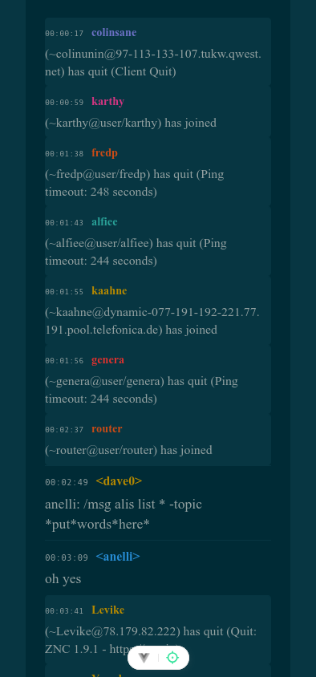

# IRC Log Viewer

A modern Vue.js application for viewing IRC channel logs with a clean, responsive interface.



## Features

- Browse available IRC channels
- View channel logs by date
- Support for different message types:
  - Regular chat messages
  - Join/Quit events
  - Nickname changes
  - User actions
- Automatic URL formatting
- Consistent nickname coloring

## Technology Stack

- Vue 3 with Composition API
- TypeScript
- Vite
- Vitest for testing
- pnpm as package manager

## Getting Started

### Prerequisites

- Node.js (LTS version recommended)
- pnpm

### Installation

```bash
# Install dependencies
pnpm install

# Start development server
pnpm dev

# Run tests
pnpm test

# Build for production
pnpm build
```

### Development

The project is structured as follows:

- `src/composables/` - Vue composables for channel, home, and log functionality
- `src/services/` - API client services
- `src/types/` - TypeScript interfaces for IRC messages and API responses
- `src/utils/` - Utility functions for formatting and display
- `src/views/` - Vue components for different views

## API Endpoints

The application connects to a backend service with the following endpoints:

- `GET /logs` - Fetch available channels
- `GET /logs/:channel` - Fetch logs for a specific channel
- `GET /logs/:channel/:date` - Fetch specific date logs for a channel
